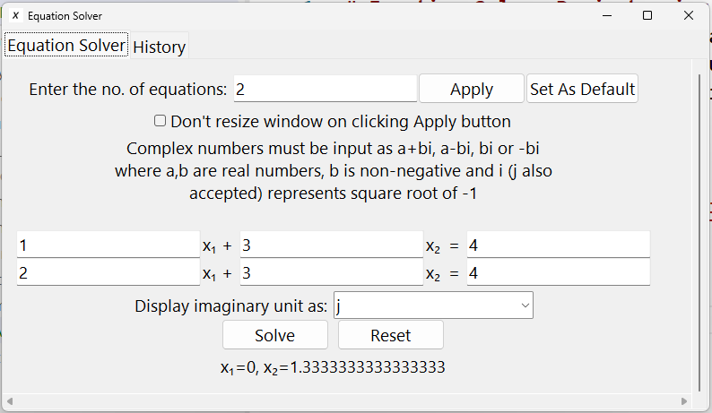
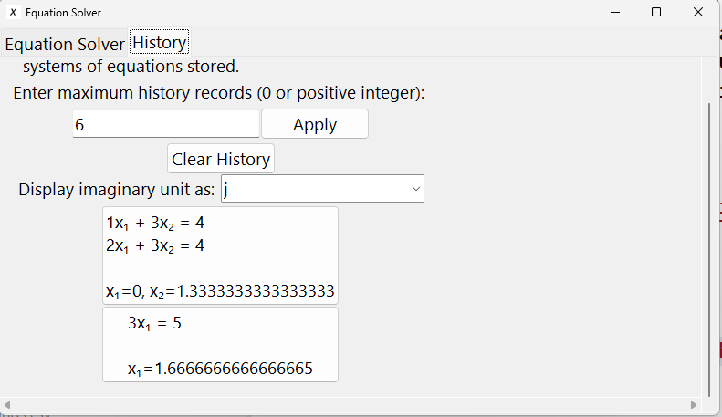

# Equation Solver Project using Tkinter in Python
This project was completed as part of my class XII practicals. This is a GUI application in which you can input a system of linear equations, and the application solves them and displays the solution if it exists. It also saves the equation history to a binary file and the user settings to a CSV file.

To start the project, clone the repo and run main.py
```bash
git clone https://github.com/krish-fanda/equation_solver.git
cd equation_solver
python main.py
```

## Equation Solver


The GUI allows you to enter the number of equations, the coefficients and RHS for each equation and then clicking on Solve gives the solution. This application can handle cases of no solution, infinitely many solutions and unique solution. It allows to you set a default number of equations with which the application will start each time

## History


Last few systems of equations input by the user are shown with their solution. You can adjust the maximum number of equations saved in the history.